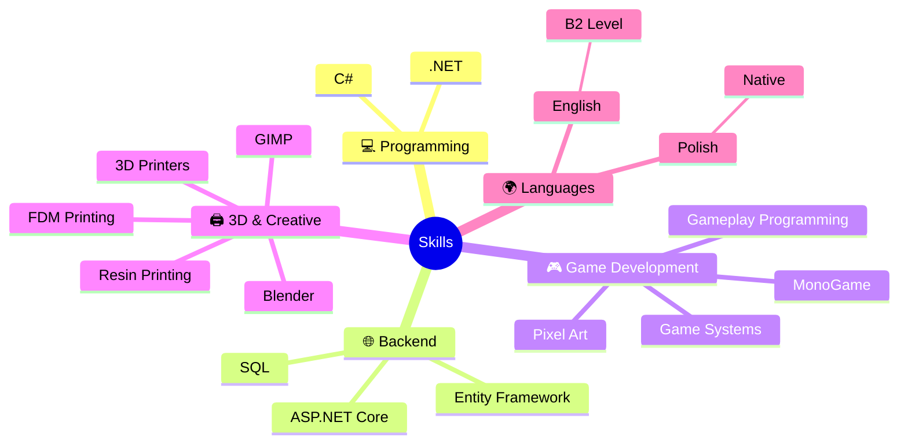
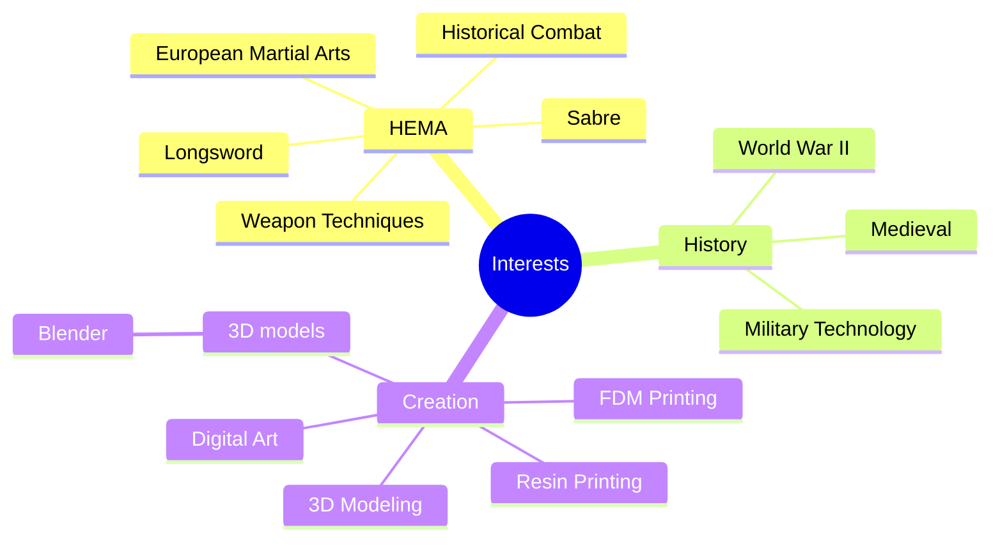

<h1>Hi, I'm Patryk</h1>

# About Me

I'm an aspiring developer focused on **C# and .NET**, interested in continuous learning and self-improvement.

## Currently working on:

🎮 **Tales of Rivermoor** — a 2D RPG game created with **MonoGame**

# 📊 My Stats

  

  

---

# 🧠 My Skills

  

# ⚔️ Beyond Code

Outside programming, I'm into:

# 📫 Contact

<table align="center">
<tr>

<td align="center" width="200">

<a href="mailto:patrykmarkiel2006@gmail.com" style="text-decoration:none; color:inherit;">

 
<b>Email</b>
</a>

</td>

<td align="center" width="200">

<a href="https://www.linkedin.com/in/patryk-markiel-205ab4396/" style="text-decoration:none; color:inherit;">

 
<b>LinkedIn</b>
</a>

</td>

<td align="center" width="200">

<a href="https://discord.com/users/bulas8" style="text-decoration:none; color:inherit;">

 
<b>Discord</b>
</a>

</td>

</tr>
</table>
